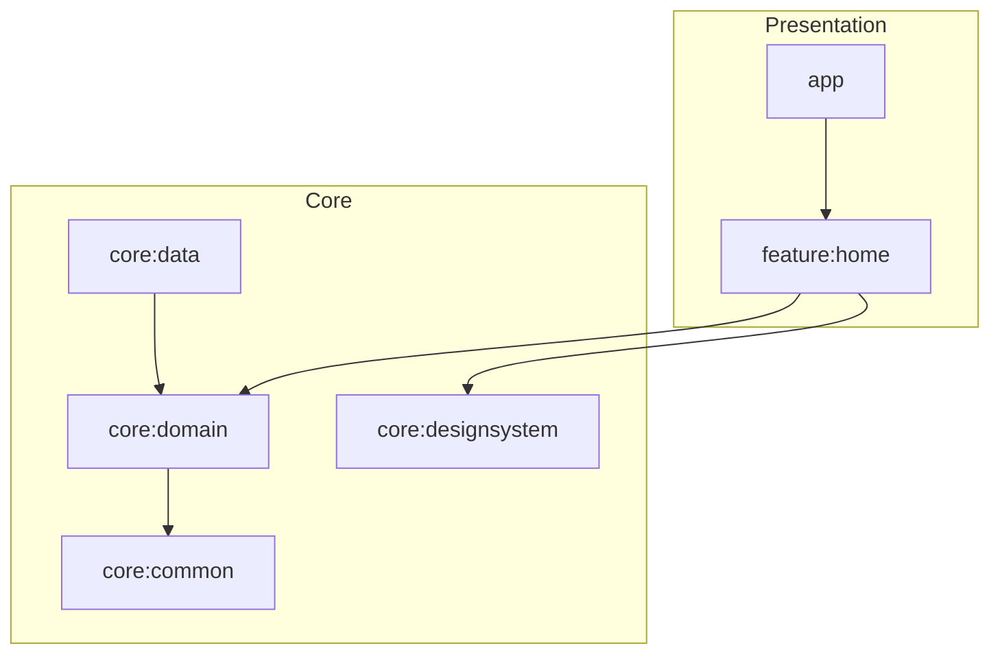

# Android Platform Starter

[](https://github.com/kanav22/android-platform-starter/actions/workflows/ci.yml)
[](LICENSE)

Production-shaped Android template for Principal-level teams — modular architecture, Compose UI, Hilt DI, Detekt, and CI quality gates out of the box.

---

## Why this exists

New Android codebases fail when architecture decisions are deferred. This starter encodes opinionated defaults so teams ship with:

- Clear module boundaries (`app` → `feature` → `core`)
- Testable domain use cases
- Compose + Material 3 design system module
- Static analysis and CI from day one

Use it to bootstrap greenfield apps, align teams on conventions, or as a reference in architecture reviews.

## Module map

```text
app/                  Application shell, Hilt entry point
feature/home/         Feature UI + ViewModel + navigation-ready screen
core/domain/          Models, repository contracts, use cases (JVM)
core/data/            Repository implementations, Hilt data bindings
core/designsystem/    Theme + reusable Compose components
core/common/          Shared primitives (Result, utilities)
```

## Architecture



| Concern | Implementation |
|---------|----------------|
| UI | Jetpack Compose, Material 3, `StateFlow` UI state |
| DI | Hilt modules per layer |
| Domain | Use cases + repository interfaces |
| Data | Fake repository (swap for Retrofit/Room) |
| Quality | Detekt, JVM + Android unit tests, GitHub Actions |

## Stack

Kotlin · Jetpack Compose · Hilt · Coroutines/Flow · Gradle Kotlin DSL · Detekt · GitHub Actions

## Getting started

### Prerequisites

- Android Studio Hedgehog or newer
- JDK 17+
- Android SDK 34

### Build

```bash
./gradlew assembleDebug
./gradlew installDebug
```

### Quality checks

```bash
./gradlew detekt
./gradlew :core:domain:test :feature:home:testDebugUnitTest
```

## CI

Every push and PR runs Detekt, unit tests, and `assembleDebug`.

## Extending the template

1. Add `feature:<name>` modules for new user flows
2. Replace `FakeCatalogRepository` with network/local data sources
3. Introduce `build-logic` convention plugins for org-wide Gradle policy
4. Run performance benchmarks (see below)

## Performance engineering

The `benchmark` module includes Macrobenchmark startup tests and a Baseline Profile generator.

```bash
# Compile benchmark harness
./gradlew :benchmark:assemble

# Run on a physical device (requires connected hardware)
./gradlew :benchmark:connectedBenchmarkReleaseAndroidTest
```

This encodes performance regression gates—the difference between "we care about architecture" and "we care about user-perceived speed."

## Related showcase repos

- [sliide-kmp-user-management](https://github.com/kanav22/sliide-kmp-user-management) — KMP + MVI + SQLDelight
- [compose-commerce-catalog](https://github.com/kanav22/compose-commerce-catalog) — Compose + golden tests
- [compose-movies-finder](https://github.com/kanav22/compose-movies-finder) — multi-module TMDB client

## License

MIT — see [LICENSE](LICENSE).
