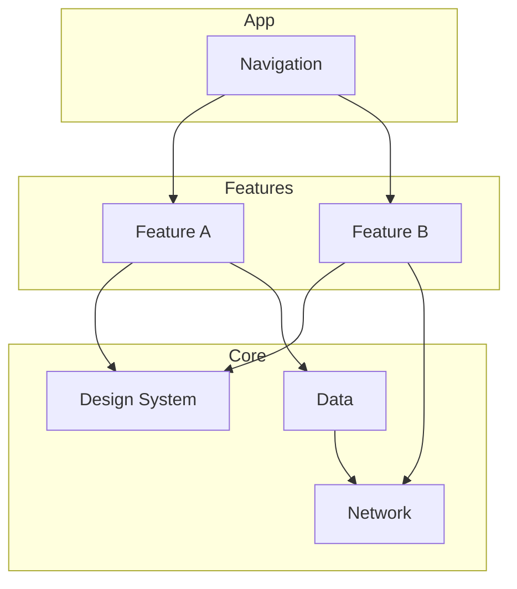

# Android Platform Starter

[](https://github.com/kanav22/android-platform-starter/actions/workflows/ci.yml)
[](https://kotlinlang.org)
[](https://developer.android.com/jetpack/compose)
[](LICENSE)

Production Android platform template — modular Compose, Hilt, Detekt, Macrobenchmark, and CI quality gates.

> Copy this repo when bootstrapping a platform team or migrating a monolith to multi-module. ADRs included.

**Author:** [Kanav Wadhawan](https://github.com/kanav22) · [Portfolio](https://www.kanavwadhawan.com)

---

## Why this exists

Most Android templates teach UI patterns. This one teaches **platform engineering**:

- Multi-module boundaries that scale with team size
- Quality gates (Detekt, tests, Macrobenchmark) wired from day one
- ADRs for decisions that survive team turnover
- CI that catches regressions before merge

Built from patterns used at Paytm (500M+ users) and Angel One (1M+ daily transactions).

---

## What's inside

| Module / area | Purpose |
|---------------|---------|
| `:app` | Application entry, navigation graph |
| `:feature:*` | Feature modules with clear public APIs |
| `:core:*` | Shared design system, network, data utilities |
| `docs/adr/` | Architecture Decision Records |
| `.github/workflows/` | CI pipeline (lint, test, build) |
| Macrobenchmark | Performance budgets and Baseline Profile setup |

---

## Quick start

```bash
git clone https://github.com/kanav22/android-platform-starter.git
cd android-platform-starter
./gradlew assembleDebug
./gradlew detekt
./gradlew :benchmark:connectedBenchmarkAndroidTest  # requires device
```

---

## Architecture



---

## Documentation

| Doc | Description |
|-----|-------------|
| [Performance budgets with Macrobenchmark](docs/articles/macrobenchmark-performance-budgets.md) | Set and enforce performance targets |
| ADRs in `docs/adr/` | Recorded architecture decisions |

---

## Related projects

| Repo | Focus |
|------|-------|
| [sliide-kmp-user-management](https://github.com/kanav22/sliide-kmp-user-management) | KMP · MVI · offline-first |
| [compose-golden-toolkit](https://github.com/kanav22/compose-golden-toolkit) | Paparazzi golden testing |
| [kanav22](https://github.com/kanav22/kanav22) | Profile & writing |

---

## License

MIT — see [LICENSE](LICENSE).

> **Note:** Copy this file to `android-platform-starter/README.md` in that repo. Adjust module names to match your actual project structure.
